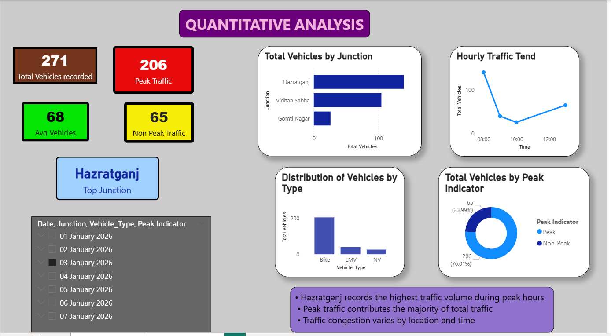

🚦 Traffic Analysis Dashboard
📌 Problem Statement

Analyze traffic patterns across different locations to identify congestion areas and peak time periods.

📊 Data Used

Traffic dataset including location, time, and vehicle count.

🛠 Tools Used

Power BI, Excel

🔍 Steps Performed
Cleaned and structured traffic dataset
Built interactive dashboard using Power BI
Analyzed traffic trends across time and locations
Identified peak congestion hours and high-traffic zones

📊 Dashboard Preview  

Key Insights
Certain locations experience significantly higher traffic volume
Peak congestion occurs during specific time intervals
Traffic patterns vary across different zones
💡 Business Recommendations
Focus traffic management efforts on high-congestion areas
Optimize signal timing during peak hours
Plan infrastructure improvements based on traffic patterns
